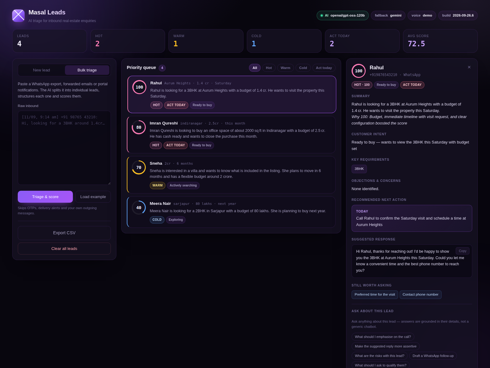

# Masal Leads

AI triage for inbound real-estate enquiries. A salesperson pastes a messy batch of
enquiries or types one in, and gets back a **ranked queue**: who to call first, what
they want, what's blocking them, and a reply ready to send.

Built for the **Masal AI FDE assignment (Round 2)**.

| | |
|---|---|
| **Live app** | **https://masal-leads.onrender.com** |
| **Demo video** (3 min) | https://drive.google.com/file/d/15a4u78YQO2tfVDrFwLBPAc96WYBNO0oj/view?usp=sharing |
| **Repository** | https://github.com/iamshubhshrma/masalAssignment |
| **AI usage disclosure** | [see below](#ai-usage-disclosure) |



---

## Requirements checklist

Everything the brief asked for, and where to find it.

**Core requirements**

| # | Requirement | Where |
|---|---|---|
| 1 | Lead intake — Name, Location, Property requirement, Budget, Buying timeline, free-text Customer message | **New lead** tab · `app/models.py:LeadIntake` |
| 2 | AI analysis — summary, intent, key requirements, objections, next action, suggested response | Detail panel · `app/analyze.py` |
| 3 | Conversational interface grounded in one lead | **Ask about this lead** · `app/chat.py` |
| 4 | Multiple saved leads, ranked by an AI-produced priority | **Priority queue** — 0–100 score + hot/warm/cold + urgency · `app/store.py:all()` |
| 5 | Clear display, scannable in seconds | Score ring, temperature band, intent and objection count per row |
| ★ | **My own feature** | **Bulk triage** (paste a raw WhatsApp dump → structured, scored leads) and an **AI voice confirmation call** — [details](#my-own-feature--two-of-them) |

**Technical requirements**

| Requirement | How it's met |
|---|---|
| At least one real AI API call, not canned | Every analysis, chat reply and triage is a live call to Groq or Gemini. There is no hardcoded path — with no API key the app returns a 503 and says so. |
| Deployed at a live URL, testable with no setup | Render free tier, Docker. Voice runs in demo mode so nothing needs credentials. |
| Public GitHub repository | Link above. |
| Free-tier resources only | Groq free tier, Google AI Studio free tier, Render free web service. No paid service anywhere. |
| AI coding assistants disclosed | [AI usage disclosure](#ai-usage-disclosure). |

---

## What I built

The brief was "help a salesperson prioritise inbound leads and act on them". The
product decision I made is that **the ranking is the feature**. A list of AI
summaries is still a list you have to read; a queue sorted by a defensible score
tells you where to start. Everything else hangs off that.

| Requirement | How it works |
|---|---|
| **Lead intake** | Form with Name, Location, Property requirement, Budget, Buying timeline, and the free-text Customer message. Only Name is required — real enquiries arrive incomplete. |
| **AI analysis** | One structured call returns lead summary, customer intent, key requirements, objections/concerns, recommended next action, and a suggested response to send. |
| **Conversational interface** | Per-lead chat grounded in that lead's fields, its analysis, and any call transcript. Ask "what should I emphasise on the call?" or "make my reply more assertive". It refuses to answer questions it has no grounds for. |
| **Lead list & prioritisation** | Every lead gets a 0–100 priority score, a hot/warm/cold band, and an urgency flag. The queue sorts by score; filters for Hot / Warm / Cold / Act today. |
| **Clear display** | Score ring, temperature, intent and objection count on every row. Full brief in one panel, no scrolling to find the next action. |

<a id="my-own-feature--two-of-them"></a>

### My own feature — two of them

**1. Bulk triage.** The scenario says *hundreds of leads a day*. Nobody types those
into a form. Paste a raw WhatsApp export, forwarded emails or portal notifications
and the AI splits the blob into individual people, structures each into the same
intake shape, and scores them all. It merges multiple messages from one person,
and skips OTPs, delivery notifications and your own outgoing messages.

This is the difference between a demo and something an agent would actually open
on a Monday morning.

**2. AI voice confirmation call** (optional, on by default in demo mode). For a
lead with a phone number, place an outbound AI voice call that confirms whether
they're still interested and books a site visit. The transcript is folded back
into the lead as new evidence and the lead is **re-scored** with it — a lead who
confirms a Saturday visit on the phone should outrank one who only filled a form.

Built on [Ringg AI](https://docs.ringg.ai)'s calling API. It runs against
simulated calls unless Ringg credentials are configured, so the live demo can
show the whole flow without spending anyone's credits.

---

## Architecture

```
 browser (vanilla JS, no build step)
    │  fetch /api/*
    ▼
 FastAPI ── app/main.py            routes, orchestration
    ├── app/analyze.py             lead → structured brief + priority score
    ├── app/chat.py                grounded per-lead Q&A
    ├── app/triage.py              raw blob → many structured leads
    ├── app/llm.py                 ONE interface over Groq + Gemini, with fallback
    ├── app/store.py               in-memory dict + JSON file
    └── app/{ringg,transcript,extract}.py   optional voice feature
```

Every AI call goes through `app/llm.py`, which owns provider selection, the
fallback chain, schema translation and retries. `analyze.py`, `chat.py` and
`triage.py` only describe *what* they want — they never talk HTTP. Adding a third
provider is one function in one file.

**Data flow for one lead:** intake → `analyze_lead()` → stored with its analysis →
rendered into the ranked queue → chat and voice both read that stored context.

---

## Which AI model, and how it's called

Two free-tier providers, in a fallback chain:

| | Model | Role |
|---|---|---|
| Primary | **Groq** `openai/gpt-oss-120b` | Fast; handles everything by default |
| Fallback | **Google Gemini** `gemini-2.5-flash` | Takes over when Groq is unavailable |

Groq's free tier is **8,000 tokens per minute**. A bulk triage of ten leads blows
straight through that. So the fallback isn't decoration — during development it
fired constantly, and you can see it in the UI: some leads say `groq:…` and others
`gemini:…` in the same batch.

**Structured calls** (`analyze`, `triage`) use each provider's native constrained
decoding — Groq's strict `json_schema`, Gemini's `responseSchema` — so the result
is schema-valid JSON, not prose I have to regex. **Chat** is a normal completion.

Both providers share one schema definition, translated per-provider in
`llm.gemini_schema()`. They disagree in ways that cost me real debugging time:

- Groq strict mode **requires** `additionalProperties: false`; Gemini **rejects**
  it with a 400. The translator strips it.
- Gemini 2.5 Flash spends output budget on thinking tokens, which silently
  truncated my JSON mid-string. Structured calls set `thinkingBudget: 0`.
- Groq strict mode occasionally drops a required field and 400s; that one retries.

### The scoring design — the decision I'd most like to discuss

My first version asked the model for a 0–100 score with a rubric in the prompt.
It scored *everything* 85–100. Every lead came back hot, which makes the ranking
worthless — the whole point is that most leads aren't urgent.

The fix was to split judgement from policy:

- **The model decides** what it's looking at: `timeline_bucket` (normalising
  "sometime after Diwali" → `3_6_months`), `has_budget`, `explicit_ask`. That's
  language understanding, which is what it's good at.
- **Python decides what that's worth.** `analyze.py` applies hard ceilings: a
  lead with no stated timeline can't exceed 60, one over a year out can't exceed
  40, no budget caps at 65. The strictest cap wins and is written into
  `score_reasoning` so the agent sees *why* ("Capped at 55 — timeline 6 12 months").

Scores went from "everything is 90" to a realistic spread. The ceilings live in
one dict, tunable without touching a prompt, and testable without an API call —
`test_analyze.py` covers every bucket.

Two more consistency rules are enforced in code because models drift on them:
temperature is **derived** from the final score (never trusted from the model), and
a cold lead can never carry an "act today" flag.

### Grounding

The lead's own words go into every prompt. The system prompt for chat carries the
intake fields, the full analysis and any call transcript — the tests assert that.
Both analysis and chat are explicitly forbidden from inventing prices, inventory
or availability. An early version cheerfully told a customer that Sarjapur villas
"range from ₹2–5 crore", a number it had no basis for and that an agent would have
to walk back. Suggesting a fabricated figure to send a real customer is worse than
saying "I don't know", so the prompt says so and a test pins it.

---

## Running it locally

```bash
git clone <this repo> && cd masal
python3 -m venv .venv
./.venv/bin/pip install -r requirements.txt

cp .env.example .env     # add GROQ_API_KEY and/or GOOGLE_API_KEY
./.venv/bin/uvicorn app.main:app --reload --port 8000
```

Open <http://localhost:8000>. Press **Fill example**, or open **Bulk triage** →
**Load example** to watch a messy WhatsApp dump become a ranked queue.

Keys: [Groq](https://console.groq.com/keys) and
[Google AI Studio](https://aistudio.google.com/apikey), both free. One is enough;
two gives you the fallback.

### Tests

```bash
./.venv/bin/python -m pytest        # 71 tests, ~2s
```

They stub the providers, so the suite is free, offline and deterministic — it
covers the cap logic, the schema translation, chat grounding, the fallback chain
and the failure paths, without spending a token.

### Deploying

Deployed on **Render's free tier** from the committed `render.yaml` blueprint:

1. Render → **New** → **Blueprint**, pick this repo, branch `main`
2. Supply the two secrets it prompts for: `GROQ_API_KEY`, `GOOGLE_API_KEY`
3. Apply — the Docker build takes ~5 minutes

`healthCheckPath` is `/api/health`, so Render reports plainly whether it came up.

The same `Dockerfile` runs on any host that takes a container and reads `$PORT`
(Railway, Koyeb, Fly). It runs as UID 1000 and installs with `pip --user`, which
also satisfies Hugging Face Spaces — though HF now requires billing for the
Docker SDK, which is why this is on Render.

**Free-tier caveat:** a free Render service sleeps after 15 minutes idle and
takes ~50s to wake. A uptime pinger on `/api/health` every 10 minutes keeps it
warm if you need it responsive.

### API

| Method | Path | Purpose |
|---|---|---|
| `GET` | `/api/health` | AI chain, build, stats |
| `POST` | `/api/leads` | Create a lead and analyse it |
| `GET` | `/api/leads` | Ranked list + stats |
| `GET` `DELETE` | `/api/leads/{id}` | Fetch / remove one |
| `POST` | `/api/leads/{id}/reanalyze` | Re-score one lead |
| `POST` | `/api/reanalyze` | Fill in any failed analyses |
| `POST` | `/api/triage` | Raw blob → many scored leads |
| `POST` `DELETE` | `/api/leads/{id}/chat` | Grounded Q&A / clear history |
| `POST` | `/api/leads/{id}/call` | Place the AI voice call |
| `POST` | `/api/calls/refresh` | Poll in-flight calls |
| `GET` | `/api/leads.csv` | Export |

Interactive docs at `/docs`.

---

## Key technical decisions

**Vanilla JS, no build step.** ~400 lines against a handful of endpoints. React
would have added a toolchain to the thing I'd have to explain in the interview
without making the product better.

**In-memory store behind a small class.** The assignment allows it. `store.py` is
the only module that knows how leads are persisted, so swapping in Postgres is one
class. On free hosting the JSON file resets on redeploy — a real deployment needs
a database, and I'd rather say that than pretend otherwise.

**Analysis runs synchronously on save.** A lead takes 2–4 seconds to analyse and
the salesperson is looking at the screen. A job queue would be correct at volume
and is overkill here; bulk triage does fan out concurrently with `asyncio.gather`.

**A failed analysis never loses the lead.** The lead is saved first, the error is
recorded on it, and the UI offers a retry. Losing someone's enquiry because a
provider 429'd is the worst possible failure for this product.

---

## Known limitations

- **Storage is ephemeral.** JSON file, no database, and no concurrent-writer
  safety beyond a single asyncio lock. Leads survive a restart locally; on free
  hosting they reset on redeploy. `store.py` is the only module that knows how
  leads are persisted, so this is one class to swap.
- **No auth.** Anyone with the URL can read and write leads. Fine for a demo,
  not for real customer data.
- **Free-tier rate limits are real.** Triaging a very large paste can exhaust
  both providers; you'll get a 503 with each provider's error rather than a
  partial result.
- **Scoring is tuned on my own judgement**, not on outcome data. The honest
  version of this learns the ceilings from which leads actually closed. The
  ceilings are in one dict precisely so they can be replaced by fitted values.
- **English-centric.** The models handle Hinglish input, but the rubric anchors
  and the suggested replies are written in English.
- **The voice call is simulated on the live URL.** It runs against canned Ringg
  responses (`MOCK_MODE=true`) so anyone can click through the whole flow without
  credentials or spending call credits. The same code path drives real calls when
  Ringg is configured; the transcript handling, the outcome merge and the re-score
  are identical either way. Real calls additionally need a KYC-verified Ringg
  account, which can only dial verified numbers until KYC completes.
- **Cold start on free hosting.** First request after 15 minutes idle takes ~50s
  while Render wakes the container.
- **No dedupe.** The same person enquiring twice becomes two leads.

---

<a id="ai-usage-disclosure"></a>

## AI usage disclosure

This was built with **Claude (Claude Code)** as the primary assistant:

- **Scaffolding and implementation** — FastAPI routes, the store, the provider
  layer, and the front end were largely AI-written from my specifications, then
  reviewed and edited by me.
- **Prompt design** — the analysis rubric and the grounding rules went through
  several rounds. The calibration anchors and the split between model judgement
  and Python policy came out of watching the scores cluster and fixing it.
- **Debugging** — the Gemini `additionalProperties` 400 and the thinking-token
  truncation were both found by running the real APIs and reading the errors.
- **Tests** — written alongside the code; the fixtures and the cap cases were
  AI-drafted and then tightened.
- **This README** — drafted with Claude, edited by me.

The Ringg integration was written against their live OpenAPI spec rather than
from memory, after finding that the documented `transcription_url` field is
sometimes an array of turns and sometimes an actual URL.

I can walk through and justify every file in this repo.
